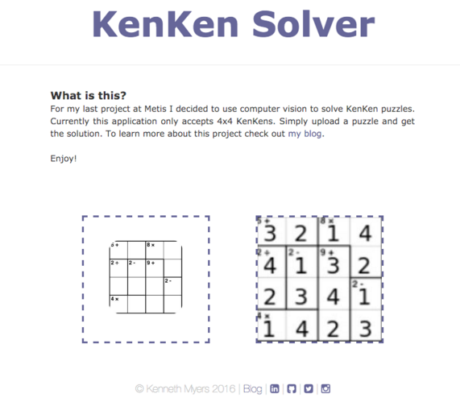

# Solving KenKen Puzzles with Computer Vision

### What is this?

This was my final project at Metis. I wanted to do something with with computer vision and/or deep learning but I also wanted to do something that would be reasonably attainable.

I was browsing project suggestions on [various college websites](https://sites.google.com/a/eng.ucsd.edu/cse-155-spring-2012/home/projects/suggested-research-projects) and one of the ideas I saw was to solve Sudoku puzzles with computer vision. It linked to a [blog post](http://sudokugrab.blogspot.com/2009/07/how-does-it-all-work.html) someone had made outlining the idea. I wanted to do this but it also something new since this seemed to be relatively easy.

I decided to go with KenKen puzzles (the reason definitely wasn't because I share my name with it). I had previously seen a Reddit post that was about algorithms for solving KenKen puzzles so all I had to focus on was the CV side of things.

You can find the final product [here](http://kenkensolver.herokuapp.com/) or at [my blog](http://kennmyers.github.io/data%20science/2016/03/29/Metis-Fifth-Project.html), where you can also read more about this project.

    

### What are these files?

* **.ipynb_checkpoints/** : ipynb checkpoints
* **base_images_artificial/** : A repo of each of the numbers and symbols made in 10 different fonts. These images weren't used in the final product but represent my failure in my initial attempt to create a train/test data artificially with notebooks [02_generate_dataset_artificial.ipynb](02_generate_dataset_artificial.ipynb) and [03_modeling_part_1.ipynb](03_modeling_part_1.ipynb).
* **base_images_true/** : A repo containing images of the numbers and symbols extracted from the real(true) puzzles contained in [puzzle_examples](puzzle_examples) and using [04_collecting_number_examples.ipynb](04_collecting_number_examples.ipynb)
* **distorted_from_artificial** : Distorted samples of the images in [base_images_artificial](base_images_artificial) made with [02_generate_dataset_artificial.ipynb](02_generate_dataset_artificial.ipynb)
* **distorted_from_true** : Distorted samples of the images in [base_images_true](base_images_true) made with [05_generate_dataset_true.ipynb](05_generate_dataset_true.ipynb)
* **flask_app/** : Contains all of the files necessary for the flask application.
* **images/** : Contains images used in these MD files.
* **presentation/** : Contains presentation material including keynote and ppt files and link to the google slides.
* **puzzle_examples/** : Contains numerous examples of KenKen puzzles used in [04_collecting_number_examples.ipynb](04_collecting_number_examples.ipynb) to create real samples of all of the numbers and symbols.
* **01_basic_image_tests.ipynb** : Preliminary tests and cage/cluster labeling.
* **02_generate_dataset_artificial.ipynb** : Generates train and test images (distorted images) from artificial images.
* **03_modeling_part_1.ipynb** : First attempt at modeling the artificial images using an SVM and Tensor Flow and predicting on true examples. Did not turn out well and was not used in the final product.
* **04_collecting_number_examples.ipynb** : Used for collecting real number and symbol examples (true images) from KenKen puzzles.
* **05_generate_dataset_true.ipynb** : Apply distortions to the true image examples.
* **06_modeling_part_2.ipynb** : Modeling of the true images using Tensor Flow. Predictions turned out much better.
* **07_solving_kenken_puzzle.ipynb** : Combines all of the previous techniques and includes an algorithm for solving KenKens to create a final, solved solution.
* **README.md** : This file.
* **Checkpoint** : Honestly not sure when this was created and not sure if it's safe to remove.
* **cv_puzzle.txt** : Output file generated in [07_solving_kenken_puzzle.ipynb](07_solving_kenken_puzzle.ipynb) used in the solving algorithm in that same ipynb. 
* **model_newest.ckpt** : Saved Tensor Flow Model
* **model_newest.ckpt.meta** : Saved Tensor Flow Model
* **puzzle.txt** : Sample puzzle file for solving algorithm
* **puzzle2.txt** : Sample puzzle file for solving algorithm
* **sample4x4_1.jpg** : Sample KenKen Puzzle
* **sample4x4_2.jpg** : Sample KenKen Puzzle (don't use this one, numbers are terrible)
* **sample4x4_3.jpg** : Sample KenKen Puzzle
* **sample4x4_clean_for_testing.jpg** : cleaned KenKen puzzle outputed from [01_basic_image_tests.ipynb](01_basic_image_tests.ipynb) so that it only has cage outlines and numbers.
